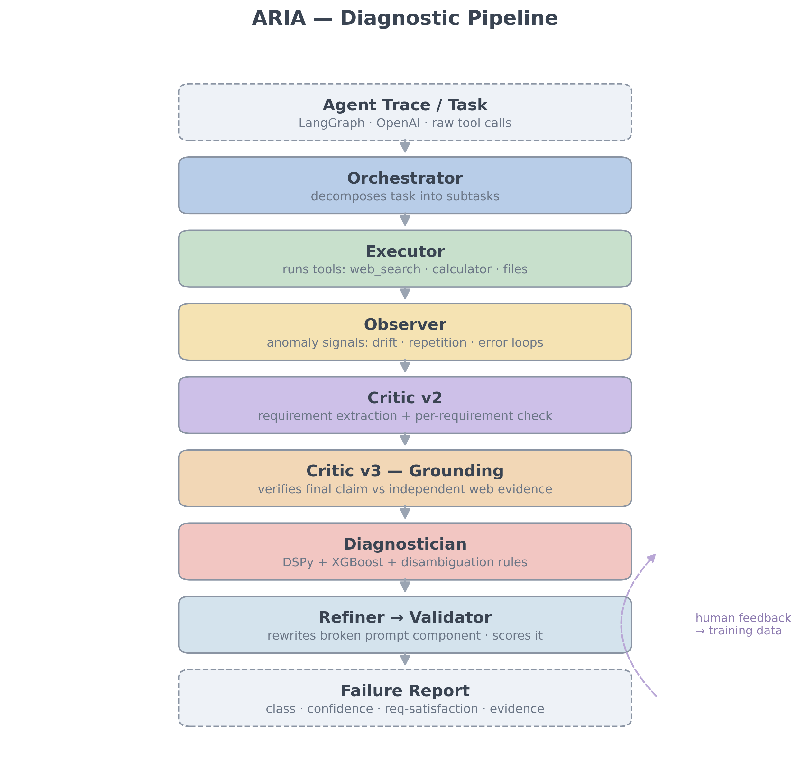

# Architecture Deep-Dive



ARIA is a cyclic LangGraph `StateGraph` of seven agents sharing a single typed state (`ARIAState`). This page explains what each stage does and why it exists.

---

## Pipeline stages

### 1. Orchestrator
Decomposes the task into subtasks and routes execution. Runs on Groq (Llama-3.3-70B) — decomposition quality matters more than latency here.

### 2. Executor
Performs the task with tools: `web_search` (DuckDuckGo), `calculator`, `read_file` / `write_file` (sandboxed to a workspace directory). Defaults to a local Ollama model (`llama3.1:8b`) so benchmark runs don't burn cloud quota. Every tool call is recorded as a trace entry — this trace is the raw material for diagnosis.

> **Diagnose-only mode** (`/diagnose`, `aria.sdk.diagnose`) skips stages 1–2: you bring the trace, ARIA runs stages 3–6 on it.

### 3. Observer
Computes cheap behavioral signals over the trace, *without* LLM calls:

| Signal | Detects |
|---|---|
| Embedding drift (goal vs. per-turn actions, cosine distance) | `prompt_drift` |
| Tool repetition (identical tool+args) | `context_overflow` |
| Tool error loops (consecutive failing calls) | `tool_misuse` |

Signals are emitted as flags with severities — they are *evidence*, not verdicts.

### 4. Critic v2 — requirement-aware evaluation
The key design decision in ARIA. Instead of asking an LLM "rate this output 1–5" (which overestimates success — it gave 5/5 to runs that never produced required files), the Critic:

1. **Extracts requirements** from the task ("calculate X", "save to Y", "cite sources")
2. **Verifies each one** against the trace and output
3. Computes `requirement_satisfaction = satisfied / total`

This change alone took human agreement from 8% to 42%.

### 5. Critic v3 — independent factual grounding
Requirement verification has a blind spot: it checks requirements are *addressed*, not that answers are *true*. Critic v3 closes it:

1. Extract the agent's central factual claim from its final answer
2. Run an **independent** web search (not the agent's own searches)
3. LLM verdict: `supported` / `contradicted` / `unverifiable` + confidence

Only runs on clean-looking results (`req_sat ≥ 0.75`, no failure detected) — it's a second opinion on runs about to be declared healthy. A contradicted claim with confidence ≥ 0.6 reclassifies the run as `hallucination_loop`. Toggle with `GROUNDING_ENABLED`.

### 6. Diagnostician
Combines all evidence into a final classification:

1. **DSPy `DiagnosticProgram`** — 5-field signature (`task_description, observer_flags, critic_scores, requirement_summary, trace_summary`), compiled with `BootstrapFewShot` on human-labeled real traces (not synthetic). The compiled program is versioned (`diagnostician_v2.json`) and auto-loaded at runtime.
2. **XGBoost classifier** — trained on ARIA-Bench signal features, used as a secondary vote.
3. **Deterministic disambiguation rules** — hard overrides encoding human-labeled findings (see [failure-taxonomy.md](failure-taxonomy.md)). Rules run *after* the LLM so they can't be argued out of.

### 7. Refiner → Validator
When a failure is diagnosed in full-pipeline mode, the Refiner rewrites the broken prompt component (e.g., adds explicit success criteria for `goal_misalignment`) and the Validator scores the rewrite. The graph can then retry the task with the refined prompt — this is the self-correction loop (`MAX_RETRIES`).

---

## The research-through-usage loop

Every API diagnosis is saved as a candidate training record. Human corrections via `/feedback` (or the dashboard's correct/wrong buttons) become labeled data. Periodically, `scripts/recompile_diagnostician_v2.py` recompiles the DSPy program on the accumulated labels — so the deployed system and the research dataset improve together.

```
diagnose → human feedback → labeled dataset → DSPy recompile → better diagnoses
```

---

## State

All stages read/write one `ARIAState` TypedDict (see `aria/state/schema.py`): task fields, executor trace, observer flags, critic scores, requirement checklist, grounding verdict, diagnosis fields, and retry bookkeeping. Single-state design keeps every stage's evidence inspectable in the final output.

## Stack

| Concern | Choice |
|---|---|
| Agent graph | LangGraph (cyclic StateGraph) |
| Cloud LLM | Groq — Llama-3.3-70B |
| Local LLM | Ollama — llama3.1:8b |
| Prompt optimization | DSPy BootstrapFewShot |
| Signal classifier | XGBoost |
| Embeddings | SentenceTransformers (bge-small-en-v1.5) |
| Grounding search | DuckDuckGo (ddgs) |
| API | FastAPI |
| Dashboard | React + Vite + Recharts |
